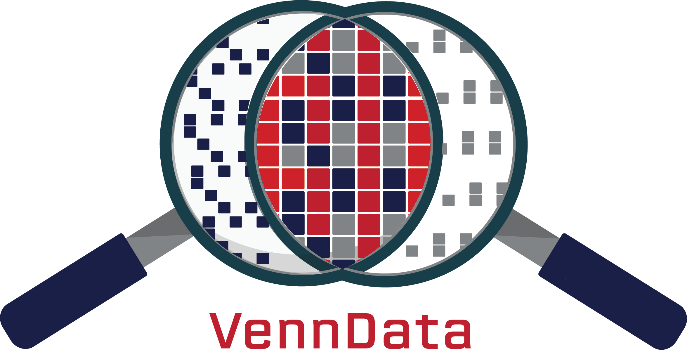

# VennData

One of the biggest barriers to widespread machine learning adoption is the difficulty in collecting a 'good' dataset. There is an overall consensus that a 'good' dataset is a big dataset, but we believe that we can do better. As such the VennData project was created to develop tools to guide in the collection, curation, augmentation and validation of data. 

# Research
Our research focuses on tackling a wide range of questions into the impacts of datasets on model performance such as, 
- Providing scores for data quality, and identifying mislabels.
- Identifying and correcting distribution shifts between test and train data.
- Understanding the role of augmentations such as pixel, perspective, rotation and translation on datasets.

# Environment and Software
### Structure
[Data_augmentation/](Data_augmentation/) - Techniques and tools used to augment data for improved performance.

[Data_Value/](Data_Value/) - Tools for scoring the value of individual data in a dataset. 

[Data_Value/Data_selection](Data_Value/Data_selection) - Data selection models trained with reinforcement learning. 

[Data_3D/](Data_3D/) - Classes and notes for Pytorch3D. 

[Utils/](Utils/) - Contains model definitions, training and evaluation scripts.  

